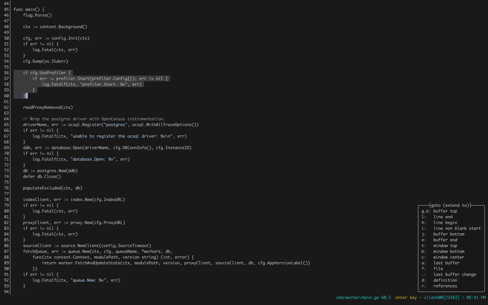

### A simple minimalistic kakoune colorscheme
inspired by [andreypopp/vim-colors-plain](https://github.com/andreypopp/vim-colors-plain)

#### Screenshot


#### Install
```plug "zkmrgirish/kakoune-plain" theme```
or move colors/kakoune-plain.kak to $XDG_CONFIG_HOME/kak/colors


#### Apply colorscheme
```colorscheme kakoune-plain```
